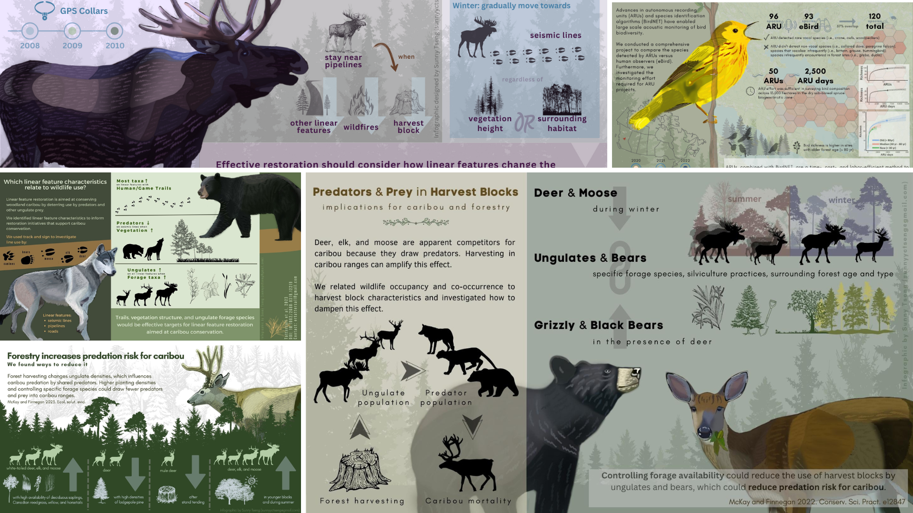

# Infographic design for a comparative study of timber harvest and wildfire

## About

The goal of this project is to make an infographic for a research entitled "Cut vs. fre: a comparative study of the temporal efects of timber harvest and wildfre on ecological indicators
of the boreal forest". Here are the relavent info:

- [Full paper](./docs/full%20paper.pdf)
- [Quick note](./docs/quick%20note.pdf)

## Product

### version 1 (May 7)

## Time line

| Item | Due | Communication with client |
| ----------- | ------------- | ------ |
| Draft of the text content | April.12 | agree on the text content |
| Graphic design            | April.19 |   |
| Text design               | April.26 |   |
| First product             | April.29 | review of the product     |
| Revision(s)*              | May.10   |   | 

*Sunny will provide 2 rounds of minor revisions for the final product. Minor revisions are usually within 1 hour of editing time for each round of revisions. After that it will be charged $35 per hour.

## Expected output

- Dimension: 1920x1080 pixel
- Orientation: Horizental
- Color: coloured
- File type: PNG, JPEG, PDF

## Expected compensation

The hourly rate for the work is $35, and I anticipate the project will require approximately 25 to 28 working hours. This translates to a total cost ranging from $875 to $980.

| Expected hours | Task |
| --- | --- |
| 6 | materials collection and text processing |
| 4 | communication (i.e., email, video call) |
| 10 | visual design |
| 4 | text design |
| 2 | review and final editing of the work |
| 2 | others |

## Tools

I will be using these platforms for designing: 

- [GIMP](https://www.gimp.org/): an image editor for most of the visual design, including digital drawing.

- [Krita](https://krita.org/en/): a professional open source painting program

- [Canva](https://www.canva.com/): a design tool for presentations and social media. I will be using canva for the text design. 

My design style. Visit my website to view more previous works: https://sunshineland.netlify.app/science/

## References

- [FUSE consulting company](https://www.fuseconsulting.ca/infographics)
- [FRI research](https://friresearch.ca/search/?frisearchable_posts%5BhierarchicalMenu%5D%5Btaxonomies_hierarchical.publication_type.lvl0%5D%5B0%5D=Summaries%20and%20Communications&frisearchable_posts%5BhierarchicalMenu%5D%5Btaxonomies_hierarchical.publication_type.lvl0%5D%5B1%5D=Infographics)

